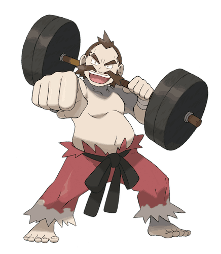
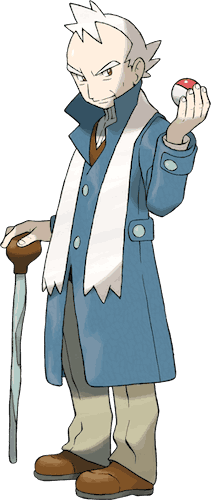
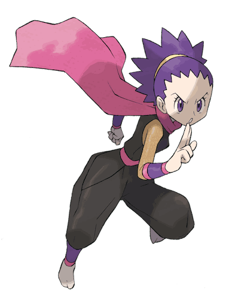
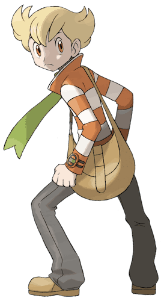
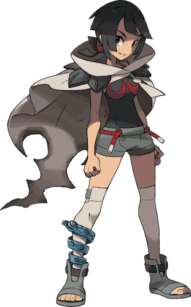
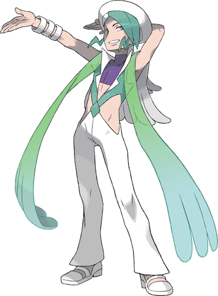
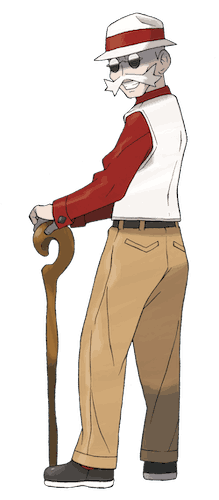

{{ collections.topLevelSection | eleventyNavigation | eleventyNavigationToHtml | safe }}

# Skills

Each character has 5 Physical Skills and another 5 Social Skills. Skills act as bonuses or penalties characters can apply to rolls.

## Physical Skills

### Athletics

**Athletics** is for lifting objects, knocking down doors, holding down foes, and other feats of strength.

<figure>

  

  <figcaption>Cianwood City’s Chuck can toss boulders that even most Pokémon can only push.</figcaption>
</figure>

### Endurance

**Endurance** is for surviving impacts, resisting illness, braving extreme conditions, and other feats of fortitude.
- Sticking at tasks for a long time
- Remaining alert on watches
- Staying awake past your bedtime
- Carrying heavy loads

<figure>

  

  <figcaption>Alola’s Professor Kukui studies Moves by taking the brunt of them himself.</figcaption>
</figure>

### Focus

**Focus** is for ignoring distractions, steadying aim, paying attention, and other feats of concentration.

<figure>

  

  <figcaption>Mahogany Town’s Pryce hones his mind by meditating under a freezing waterfall every morning.</figcaption>
</figure>

### Stealth

**Stealth** is for keeping still, avoiding notice, moving silently, and other feats of sneakiness.

<figure>

  

  <figcaption>Fuchsia City’s Janine is a renowned teacher of ninjutsu, especially techniques that confound and sap the opponent.</figcaption>
</figure>

### Acrobatics

**Acrobatics** is for sprinting, jumping, balancing, and other feats of dexterity.

<figure>

  

  <figcaption>Sinnoh’s Barry runs around so quickly that others barely have time to see him coming.</figcaption>
</figure>

## Social Skills

**Social Skills** represent how characters interact with others.

A high rank in a Social Skill doesn’t have to mean the character appears that way. Characters with high Bluster can be frail, but value grit and won’t back down from hardship. Characters with high Insight may make poor judgments, but excel at determining the wants and feelings of others.

### Intensity

Characters with high **Intensity** aim to inspire or rouse others, and are fiercely passionate about ideals and convictions.

<figure>

  

  <figcaption>Hoenn’s Zinnia is notorious for interrupting disaster-prevention efforts because she believes their methods are morally wrong.</figcaption>
</figure>

### Bluster

Characters with high **Bluster** want to awe or intimidate others, and are dedicated to self-sufficiency.

<figure>

  

  <figcaption>Alola’s Guzma keeps his underlings in line by constantly threatening them, even if he’s never seen backing up his threats.</figcaption>
</figure>

### Composure

Characters with high **Composure** keep calm under pressure, and are used for checks to stay calm, keep up an act, or remember a character’s lines.
- Calm down/soothe others
- Appearing unbothered, even (especially) when you are

<figure>

  

  <figcaption>Sootopolis City’s Wallace never breaks his act even when the world itself is going wrong.</figcaption>
</figure>

### Insight

Characters who prize **Insight** strive to understand and interpret others, and value experience and creativity.

<figure>

  

  <figcaption>Cinnabar Island’s Blaine loves quizzing people to test their knowledge and also their reactions to success and failure.</figcaption>
</figure>

### Deception

Characters with high **Deception** can hide their emotions and intents, putting on a performance without drawing attention to it.

<figure>

  

  <figcaption>Goldenrod City’s Whitney acts approachable and professional, even though she’s actually emotional and ruthless.</figcaption>
</figure>

## Battle

A large part of the Pokémon world is battle. Battling can be dangerous, but also a safe and fun way for Trainers and Pokémon to learn about each other. Society has grown around battles so much that it has special rules elaborated on in [the Combat & Danger section](/rules/combat+danger/).

Wild Pokémon love battling, especially after they evolve into stronger forms. Trainers treat battle as a sport and will casually challenge each other. When Trainers or wild Pokémon challenge each other, the GM declares a battle. Players choose which Pokémon to begin the battle with and then Combat starts.

A Trainer battle usually decides how many Pokémon to use and how much to bet beforehand. Both sides secretly choose which Pokémon to send out first, then simultaneously reveal their choices.
